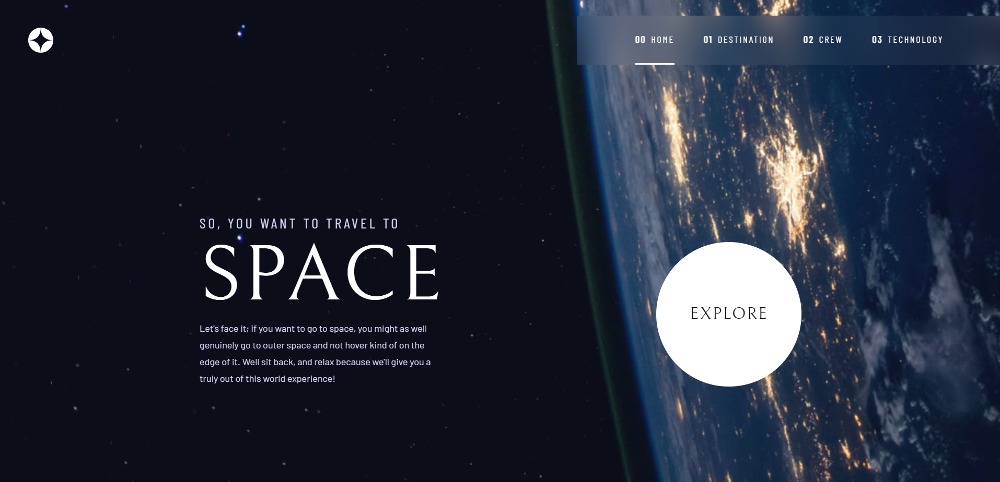
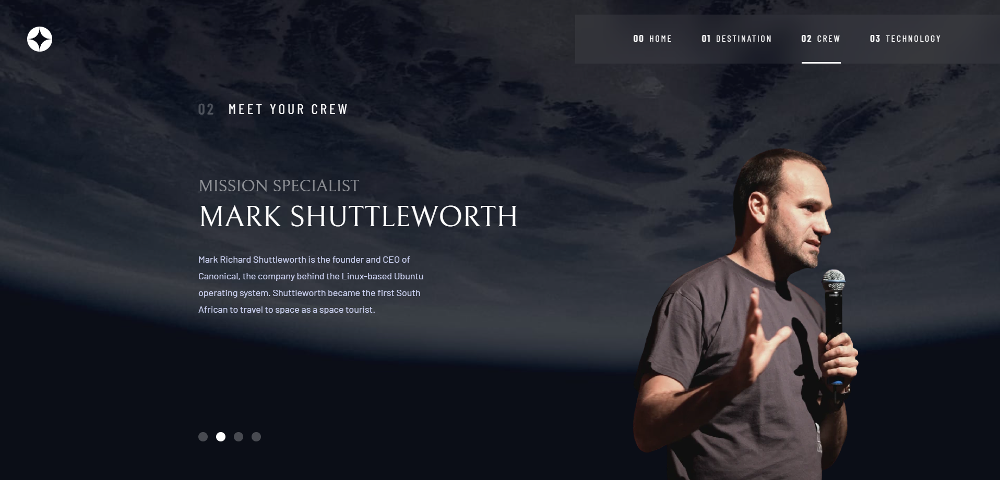
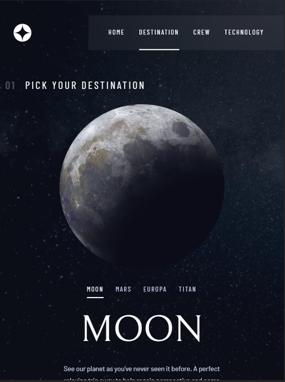
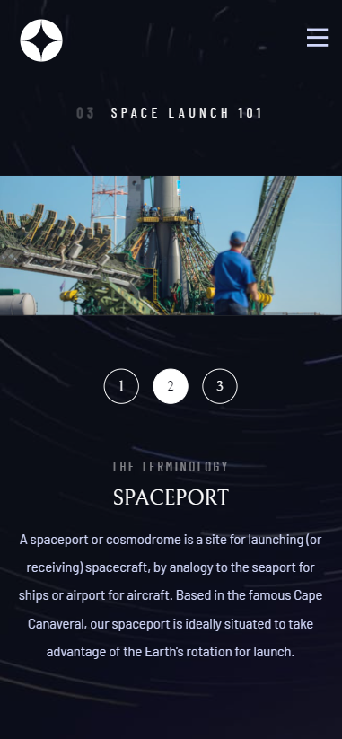
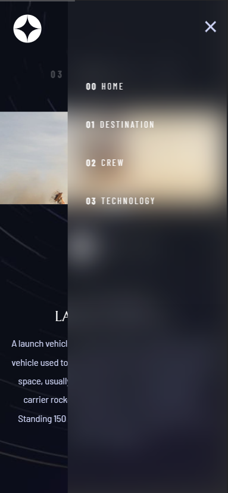

# Frontend Mentor - Space tourism website solution

This is a solution to the [Space tourism website challenge on Frontend Mentor](https://www.frontendmentor.io/challenges/space-tourism-multipage-website-gRWj1URZ3). Frontend Mentor challenges help you improve your coding skills by building realistic projects. 

## Table of contents

- [Overview](#overview)
  - [The challenge](#the-challenge)
  - [Screenshot](#screenshot)
  - [Links](#links)
- [My process](#my-process)
  - [Built with](#built-with)
  - [What I learned](#what-i-learned)
  - [Useful resources](#useful-resources)
- [Author](#author)
- [Acknowledgments](#acknowledgments)

## Overview

### The challenge

Users should be able to:

- View the optimal layout for each of the website's pages depending on their device's screen size
- See hover states for all interactive elements on the page
- View each page and be able to toggle between the tabs to see new information

### Screenshot

- Main: ;
- Crew_Desktop: ;
- Destination_tablet: ;
- Technology_mobile;
- Side-menu ;

### Links

- Solution URL: [Add solution URL here](https://your-solution-url.com)
- Live Site URL: [Add live site URL here](https://your-live-site-url.com)

## My process

### Built with

- Semantic HTML5 markup
- CSS custom properties
- Flexbox
- CSS Grid
- Mobile-first workflow

### What I learned

HTML
- <template> element

CSS
- Using customized utility classes as a strategy to render the website.
  - Specifically, I learnt about reseting properties in a more professional level
  - Making websites/multi-page websites more accessible friendly like introducing .sr-only, .skip-to-content, 
    ```
    @media (prefers-reduced-motion: reduce) {  
      *,
      *::before,
      *::after {
        animation-duration: 0.01ms !important;
        animation-iteration-count: 1 !important;
        transition-duration: 0.01ms !important;
        scroll-behavior: auto !important;
      }
    }
    ```
  - Other new CSS medthods:
    - :where(:not(:first-child)) 
    - :focus-visible

Javascript
- How to load and read data from multiple HTML files
```
const fetchAndProcessHTML = async (url, processData, data) => {
  const response = await fetch(url);
  const html = await response.text();
  const parser = new DOMParser();
  const doc = parser.parseFromString(html, 'text/html');
  processData(data, doc);
};
```

- Using template element created in the HTML files to clone and render HTML elements.
```
const clone = c_ArticleTemplate.content.cloneNode(true);

let c_ArticleEle = clone.querySelector('article');
```

### Useful resources

- [<template>](https://developer.mozilla.org/en-US/docs/Web/HTML/Element/template) 
  - This helped me to understand how to use templates to hold content and hide them when the page loads. It is really useful as compared to relying entirely on Javascript.


## Author

- Frontend Mentor - [@Jo-cloud85](https://www.frontendmentor.io/profile/Jo-cloud85)

## Acknowledgments

I used this chance to learn CSS tips from Kevin Powell through his Scrimba tutorial - https://scrimba.com/learn/spacetravel. The differences are:
- I edited/added quite a number of lines in CSS to suit my styles in bringing the solution closer to the desired final product.
- I prefer using json file and javascript to render information to the webpages instead of purely static HTML.
